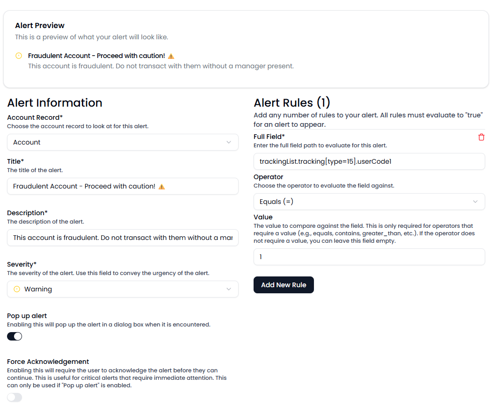
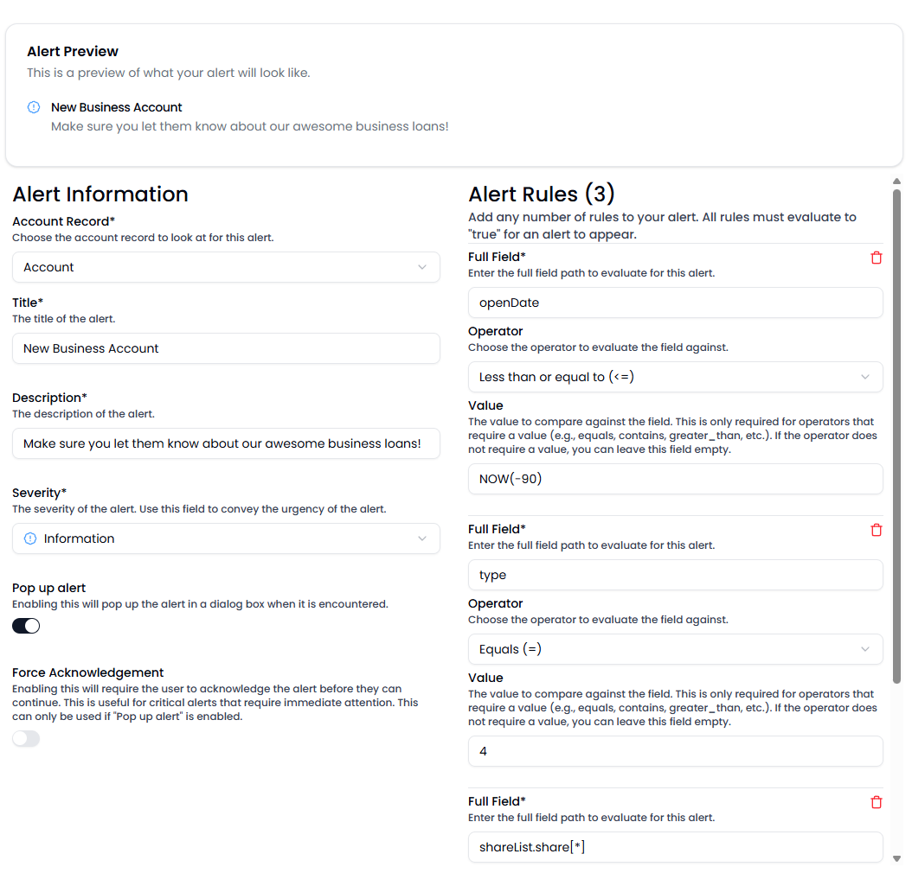

### Alerts - Best Practices

Alerts should be used sparingly, especially those that pop up, even more so if you are requiring the user to acknowledge the alert. 

Alert (Alarm) fatigue is very real, and can have a negative effect on your alerts. The more you alert, the more your employees become desensitized. See https://en.wikipedia.org/wiki/Alarm_fatigue for more information.

Alerts in the MRM come in two distinct flavors - alerts that are meant to be read, and alerts that are meant to be acknowledges. The MRM allows you to granularly pick and choose which flavor you want for each alert. For alerts that require heightened attention, you may want to enable the Pop Up option. For alerts where you know the employee is interacting with a known fraudulent account and want to ensure they understand the risks, you may want to enable "Force Acknowledgement". These options are here for the credit union to define, and pick what's best for their culture.

It's a good idea to train your staff on understanding the difference between the different alerts in the MRM. Alerts will always be ordered by severity (Danger, then warning, then information) and are color-coded to make it abundantly clear what severity an alert is.

Alert rules should be simple and predictable. Your credit union process should drive an alert, not the other way around. 

Let's say for example, you want to alert your employees when an account is fraudulent. The account may not be closed for regulatory reasons, and therefore an employee may still interact with it. Your credit union process may have you apply a tracking record, or add a warning to the account. In the alert manager, you could define the following:

Now, lets say you want to alert the employee if the member is a new business account. You could do something like the following:

In this instance, we're checking if the account open date is within the past 90 days, and the account type is 4. We may also want to check if they have an open share, in which case we can dig into the shareList.share[*] array and check if it is not null.