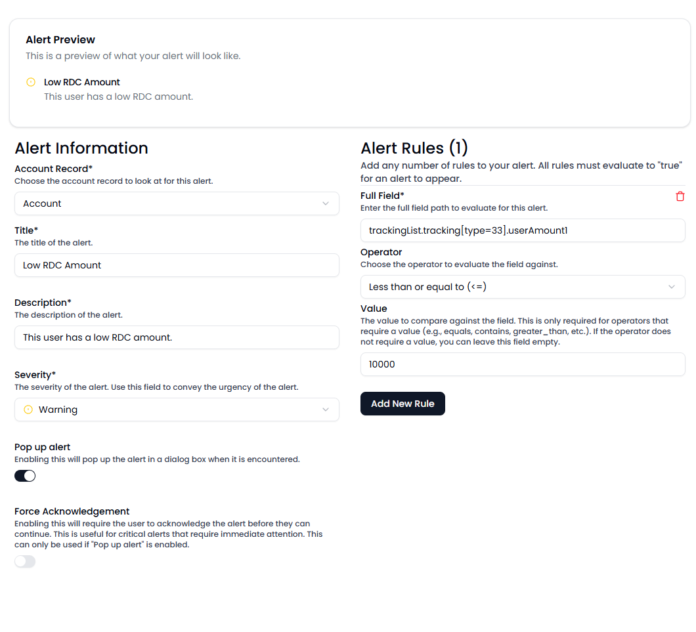

### MRM - Alerts - Creating an alert

To create an alert, you'll need Member Relationship Manager administrator access.

To get started with alerts, head to the MRM section of Managed Memberwise dashboard, [or click here](https://memberwise.io/dashboard/mrm/alerts).

Click "Create Alert" to start creating an alert.

You should then see the alert creation scree.

To begin, select the account record you'd like to have this alert be configured against.

You can select any of the base records that can be accessed in the MRM (more records coming soon).

For example, if you select "Share", the configured alert will only execute if a user has selected a share. Alerts will only ever be executed on the records they are configured for. This is true for names inside of shares, loans or cards.

Configure the title and description of the alert. As you fill out these fields, you will see the Alert Preview populate with your changes.

The severity is a training tool that gives users an at-a-glance view of any particularly egregious alerts.

You can force alerts to appear in a popup window that must be dismissed by enabling "Pop up alert".

You can add any number of rules to an alert, although it's best to keep your alert rules simple. Rules can be numbers, strings of text or dates.

If "Pop up alert" is toggled on, you can also toggle "Force Acknowledgement". This will add an input in the dialog box that forces the user to type "I UNDERSTAND" before they can move further into the account.

All rules in an alert must evaluate to "true" for the alert to trigger.

The "field" option can be any item within a record, this includes items like warning codes, tracking records, etc. Below are some example alerts to help in your alert creation.

#### Account

| Field mnemonic        | Field value                                 | Operator                 | Value      | Notes                                                                                         |
| --------------------- | ------------------------------------------- | ------------------------ | ---------- | --------------------------------------------------------------------------------------------- |
| AFROZENCODE           | frozenCode                                  | equals                   | 0          | If the account's frozen code value is "0", this will equate to true.                          |
| WARNING:20            | warningCode[*].warningCode                  | contains                 | 5          | If the account record warnings list has a warning code of "5", this will equate to true.      |
| AOPENDATE             | openDate                                    | less_than_or_equal_to    | NOW(-180)  | If the account's open date is <= now - 180 days, this will equate to "true"                   |
| AACTIVITYDATE         | activityDate                                | greater_than_or_equal_to | 2020-01-01 | If the account's activity date is on 01/01/2020, this will equate to true                     |
| TRACKING:TYPE         | trackingList.tracking[*].type               | equals                   | 33         | If the account has a tracking type 33, this will equate to true.                              |
| TRACKING:USERAMOUNT12 | trackingList.tracking[*].userAmount12       | equals                   | 10000      | If the account has ANY tracking with an userAmount12, this will equate to true.               |
| TRACKING:USERAMOUNT12 | trackingList.tracking[type=33].userAmount12 | equals                   | 10000      | If the account a tracking type 33 with userAmount12 equal to 10000, this will equate to true. |

These rules are very powerful, as they allow you to dig into a record without writing any PowerOn or special code to identify if a condition is true.

Rules can be re-used for flows and other features (coming soon)

Below are some examples of some complex rules

This rule will alert the employee if a tracking 33 is found on the account record (in this credit union's case, this is the RDC tracking record) AND that tracking record userAmount12 is <= 500.00

Just like in a poweron, you can dig deep into the account record from the account, but not the other way around. In your account rules, you can add shareList or loanList to your "Full Field" field to bubble deeply nested alerts up to the top.

The account record can access any child records, while child records cannot access parent records. The account tree cascades downward, never upward.
