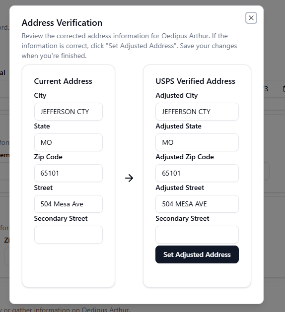

### Address Verification

Address verification can be performed on any name record.

To verify an address, navigate to the "Address Information" section of a name record and click "Verify address".

Once clicked, the "Verify Address" dialog box will open and attempt to verify the address.

If the address is unable to be verified, the dialog box will display an error message.

If the address was able to be found, an USPS verified address will be displayed on the right hand side of the dialog box. Click "Set Adjusted Address" to apply the address to the name fields.

You must save your changes after setting the adjusted address.